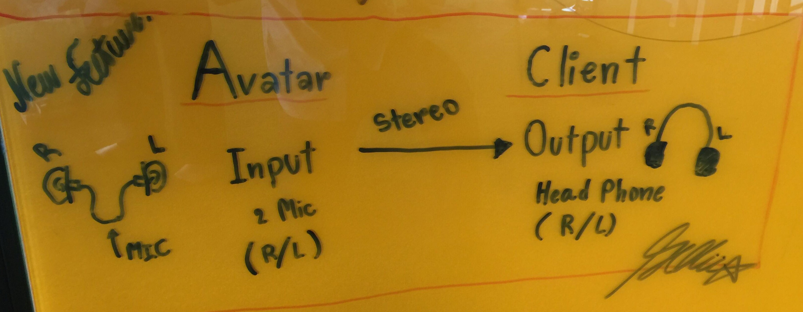

# Stereo Sound Via UDP
## Outline

## Needs
- Headphone 
- 2 Mic
## Reference
1. https://www.swharden.com/wp/2011-07-08-create-mono-and-stereo-wave-files-with-python/
1. https://3diosound.com/
1. https://people.csail.mit.edu/hubert/pyaudio/docs/
