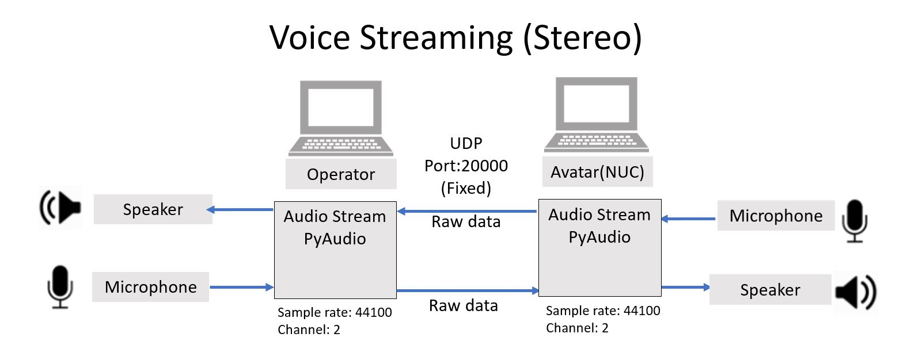
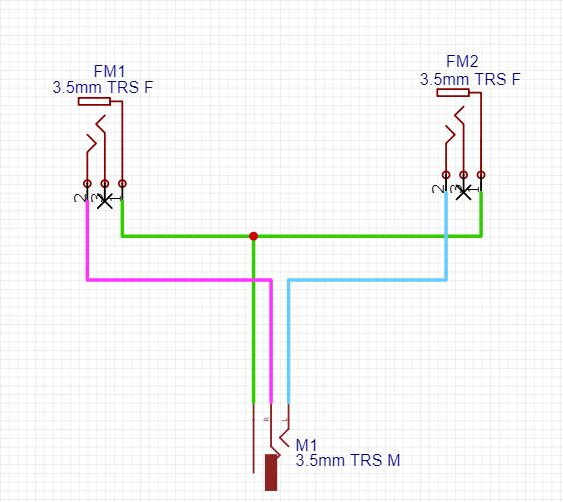

# Sound_Client.py

## System Overview

## Requirement:
- Miniconda : https://docs.conda.io/en/latest/miniconda.html 
- Create env Python 3.6 : "conda create -n myenv python=3.6"
- PyAudio : "pip install PyAudio"

## How to install pyaudio:
Follow this: https://pypi.org/project/PyAudio/

## How to use this: 
1. Wait for the server open. [User must setting the serverAddressPort ("IP")](first parameter) 
- python Sound_Client.py [Server IP] 0 ## Default
- python Sound_Client.py [Server IP] [Input_Index] [Output_Index]
- python Sound_Client.py [Server IP] # SetDevice in Program
2. Run program

## Warning!!!!!
Don't forget to check and change *server* IP every time.[Change at 1st parameter)]

# Stereo Cable Structure

## Stereo Cable info
Separate Channels of Microphone by get sound signal from tip of (TS and TRS)Mic and put that signal to Right and Left(Tip and Ring of TRS Male Jack

*** You can use earbuds or headset instead of microphone

