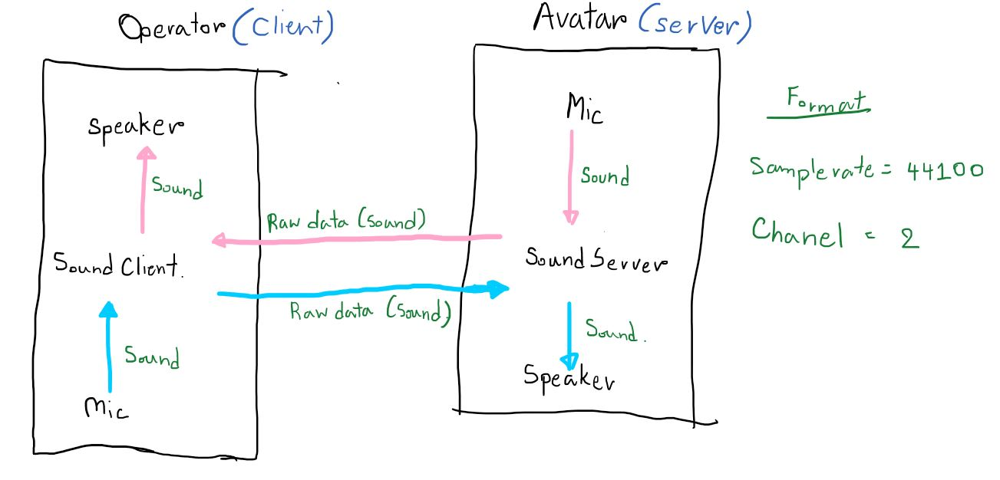

# Communication Module Client
## System Overview

## Requirement:
- Miniconda : https://docs.conda.io/en/latest/miniconda.html 
- Create env Python 3.6 : "conda create -n myenv python=3.6"
- PyAudio : "pip install PyAudio"

## How to install pyaudio:
Follow this: https://stackoverflow.com/questions/52283840/i-cant-install-pyaudio-on-my-python-how-to-do-it/55630212

## How to use this: 
1. Wait for the server open. [User must setting the serverAddressPort ("IP",port)]
1. Run the Communication Module Client Code.
1. Finish XD !!!!

## Warning!!!!!
Don't forget to check and change *server* IP and Port every time.[Change at serverAddressPort(Line 5)]
 
